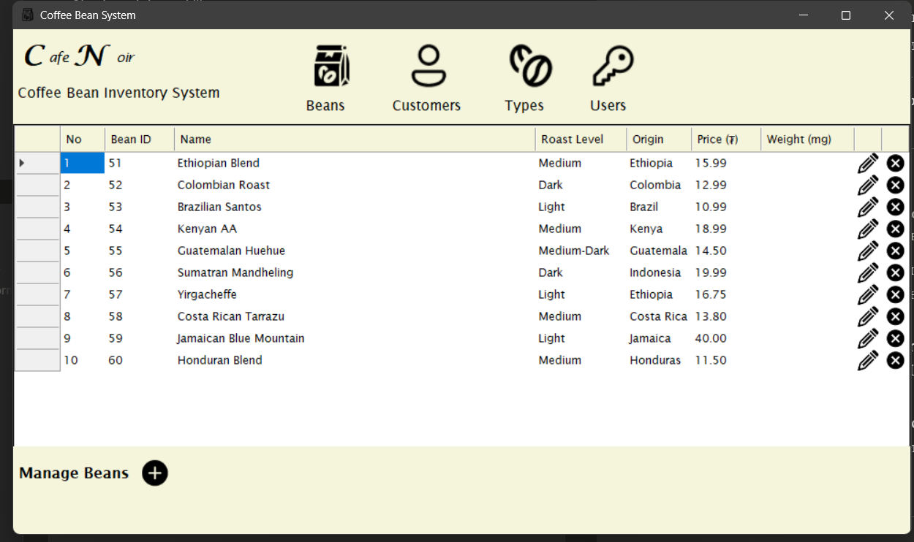

# CafeNoir — Coffee Bean Inventory System

A desktop inventory management app built with C# Windows Forms and SQL Server, made as a project for my Visual Programming class.

---

## Screenshots

### Bean Inventory

---

## What it does

- **Login** — username and password authentication
- **Beans** — view, add, edit, and delete coffee bean products
- **Customers** — manage customer records
- **Types** — manage roast categories (Light, Medium, Dark, etc.)
- **Users** — manage system user accounts

The app uses an MDI layout so everything opens inside one main window without jumping between separate windows.

---

## Built with

- C# / .NET Framework
- Windows Forms (WinForms)
- Microsoft SQL Server Express
- Visual Studio

---

## About

This was made as a course project for my Visual Programming class.